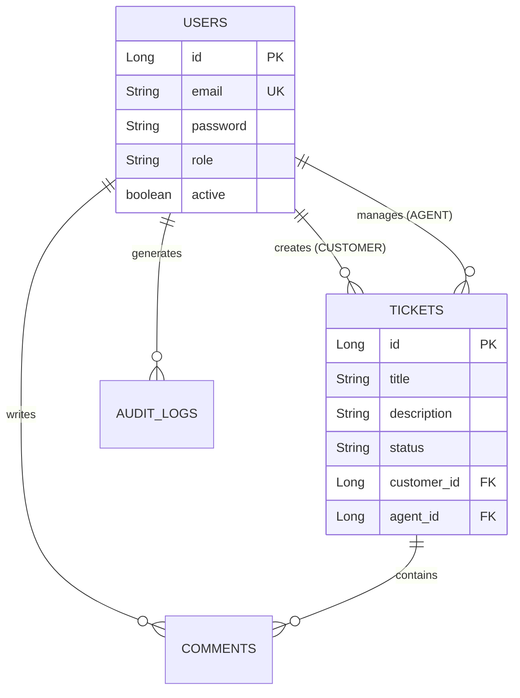

# Helpdesk System — REST API & Web Dashboard


A Full-Stack application powered by Spring Boot for IT support ticket lifecycle management, featuring RESTful architecture, advanced security, and an integrated web dashboard.

---

## Key Features

* **JWT Authentication & Authorization:** Stateless session management with Role-Based Access Control (RBAC):
  * `CUSTOMER`: Ticket creation, status tracking, and commenting.
  * `AGENT`: Ticket assignment, status updates, and support management.
  * `ADMIN`: Full user management (CRUD, enable/disable), auditing, and activity logs.
* **Ticket Lifecycle Flow:**
  `OPEN` ➔ `IN_PROGRESS` ➔ `WAITING_FOR_CUSTOMER` ➔ `RESOLVED` ➔ `CLOSED`
* **Audit & Activity Logging:** Automatic tracking of critical user actions for security and compliance.
* **Integrated Frontend:** Web-based interface for streamlined login, dashboard management, and data tables.

---

## Tech Stack

* **Backend:** Java 25, Spring Boot 4.0.6, Spring Data JPA, Spring Security (JWT)
* **Database:** PostgreSQL 17
* **DevOps & Tools:** Docker, Docker Compose, Maven, Lombok

---

## Core API Reference

| Method | Endpoint | Description | Access Level |
| :--- | :--- | :--- | :--- |
| `POST` | `/api/v1/auth/login` | User authentication & JWT generation | Public |
| `GET` | `/api/v1/tickets` | List tickets (filtered by role) | All Roles |
| `POST` | `/api/v1/tickets` | Create a new ticket | `CUSTOMER` |
| `PATCH` | `/api/v1/tickets/{id}/status` | Update ticket status | `AGENT` / `ADMIN` |
| `GET` | `/api/v1/admin/users` | Full user management | `ADMIN` |
| `GET` | `/api/v1/admin/logs` | View activity audit logs | `ADMIN` |

---

## Database Architecture (ER Diagram)



---

## Quick Start with Docker

### 1. Build the Application

Generate the executable JAR file while temporarily skipping tests:

```bash
./mvnw clean package -DskipTests

```

*(On Windows, run `.\mvnw.cmd clean package -DskipTests`)*

### 2. Launch Containers

```bash
docker compose up --build -d

```

The application and database will be accessible at:

* **Web App & REST API:** `http://localhost:8080`
* **PostgreSQL Database:** `localhost:5432` *(DB: `helpdesk_db`, User: `stefano`)*

---

## Test Credentials (Default Admin)

Upon initial startup, the database is automatically seeded via the `01-init-admin.sql` script:

* **Email:** `admin@helpdesk.com`
* **Password:** `admin123`
* **Role:** `ADMIN`
