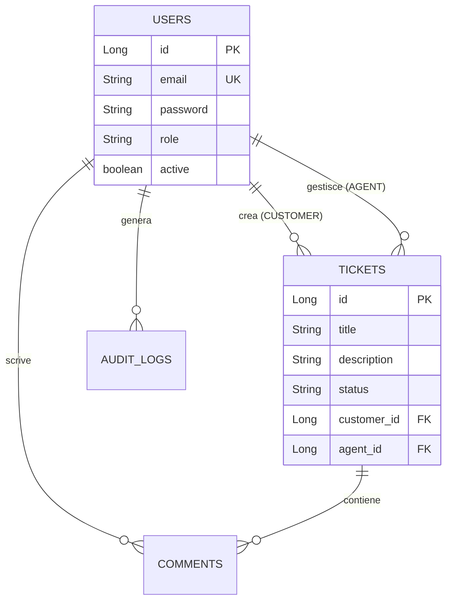

# Helpdesk System — REST API & Web Dashboard


Applicazione Full-Stack basata su Spring Boot per la gestione del ciclo di vita dei ticket di supporto tecnico, dotata di architettura RESTful, sicurezza avanzata e dashboard web integrata.

---

## Funzionalità Principali

* **Autenticazione & Autorizzazione JWT:** Gestione delle sessioni stateless con permessi basati sui ruoli:
  * `CUSTOMER`: Creazione ticket, tracciamento stato e inserimento commenti.
  * `AGENT`: Presa in carico, aggiornamento dello stato e gestione del supporto.
  * `ADMIN`: Gestione utenti (CRUD, attivazione/disattivazione), auditing e log delle attività.
* **Ciclo di Vita del Ticket:**
  `OPEN` ➔ `IN_PROGRESS` ➔ `WAITING_FOR_CUSTOMER` ➔ `RESOLVED` ➔ `CLOSED`
* **Audit & Activity Logging:** Registrazione automatica delle azioni critiche eseguite dagli utenti a scopo di sicurezza e controllo.
* **Frontend Integrato:** Interfaccia web nativa per la gestione rapida di login, dashboard e tabelle dati.

---

## Stack Tecnologico

* **Backend:** Java 25, Spring Boot 4, Spring Data JPA, Spring Security (JWT)
* **Database:** PostgreSQL 17
* **DevOps & Tools:** Docker, Docker Compose, Maven, Lombok

---

## API Reference Principale

| Metodo | Endpoint | Descrizione | Accesso |
| :--- | :--- | :--- | :--- |
| `POST` | `/api/v1/auth/login` | Autenticazione e generazione JWT | Pubblico |
| `GET` | `/api/v1/tickets` | Lista ticket (filtrata per ruolo) | Tutti i ruoli |
| `POST` | `/api/v1/tickets` | Creazione di un nuovo ticket | `CUSTOMER` |
| `PATCH` | `/api/v1/tickets/{id}/status` | Aggiornamento dello stato del ticket | `AGENT` / `ADMIN` |
| `GET` | `/api/v1/admin/users` | Gestione completa degli utenti | `ADMIN` |
| `GET` | `/api/v1/admin/logs` | Consultazione dell'Activity Log | `ADMIN` |

---

## Architettura Database (ER)



## Avvio Rapido con Docker

### 1. Compilazione dell'applicazione

Genera il file JAR eseguibile saltando i test temporaneamente:

  

Bash

```
./mvnw clean package -DskipTests

```

_(Su Windows usa `.\mvnw.cmd clean package -DskipTests`)_

  

### 2. Avvio dei Container

Bash

```
docker compose up --build -d

```

L'applicazione e il database saranno operativi ai seguenti indirizzi:

  

-   **Web App & REST API:** `http://localhost:8080`
    
      
    
-   **PostgreSQL Database:** `localhost:5432` _(DB: `helpdesk_db`, User: `stefano`)_
    
      
    

## Credenziali di Test (Default Admin)

Al primo avvio, il database viene popolato automaticamente tramite lo script `01-init-admin.sql`:

  

-   **Email:** `admin@helpdesk.com`
    
      
    
-   **Password:** `admin123`
    
      
    
-   **Ruolo:** `ADMIN`
